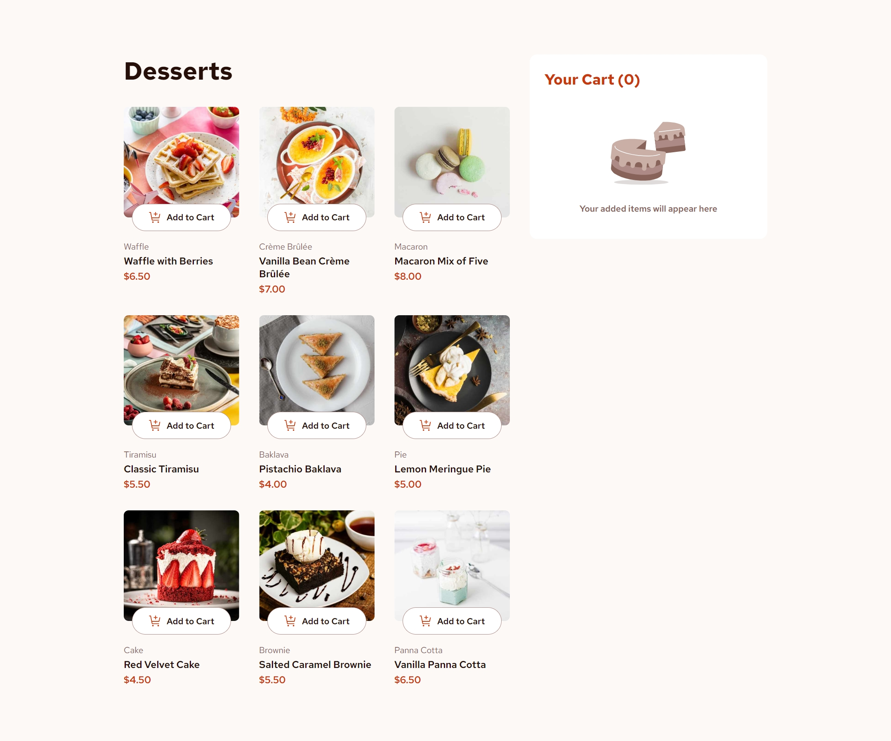
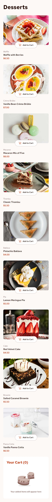

# Product List with Cart

A modern, responsive e-commerce interface built with React 19 and TypeScript. This application features a dynamic product catalog, a real-time shopping cart system, and a seamless order confirmation flow, all styled with precision using custom CSS.





## Features

### 🛒 Core Features
- **Dynamic Product Catalog:**  Beautifully rendered product cards with engaging hover states.
- **Smart Cart System:** Real-time updates for adding items, adjusting quantities, and calculating totals.
- **Order Confirmation:**  A polished modal summary that displays purchased items and total cost upon checkout.
- **Responsive Design:**  Optimized layouts for desktop, tablet, and mobile devices to ensure a consistent experience.
- **Interactive UI:**  Smooth transitions, active states, and intuitive controls for a premium feel.

### 🛠 Tech Stack
- **Framework:** React 19 + Vite 7
- **Language:** TypeScript
- **Styling:** Custom CSS (Responsive & Mobile-First)
- **Data Source:** Local JSON Data Integration
- **Linting:** ESLint + TypeScript-ESLint

## Getting Started

1. **Clone the repository**
   ```bash
   git clone https://github.com/your-username/product-list-with-cart.git
   cd product-list-with-cart
   ```

2. **Install dependencies**
   ```bash
   npm install
   ```

3. **Start development server**
   ```bash
   npm run dev
   ```

4. **Build for production**
   ```bash
   npm run build
   ```

## Usage

- **Browse:** Scroll through the list of delicious desserts.
- **Add to Cart:** Click "Add to Cart" on any item. Use the +/- controls to adjust quantity.
- **Review:** See your cart summary update instantly in the sidebar (desktop) or bottom section (mobile).
- **Checkout:** Click "Confirm Order" to view the order summary modal.
- **Reset:** Start a fresh order by clicking "Start New Order" in the modal.

## Author

- **Frontend Mentor** - [@MhistaFortune](https://www.frontendmentor.io/profile/MhistaFortune)
- **Twitter/X** - [@fortunate_egwu](https://www.twitter.com/fortunate_egwu)

## Acknowledgments

- [Frontend Mentor](https://www.frontendmentor.io) for the challenge design and assets.
